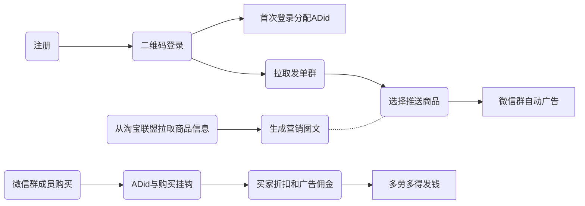
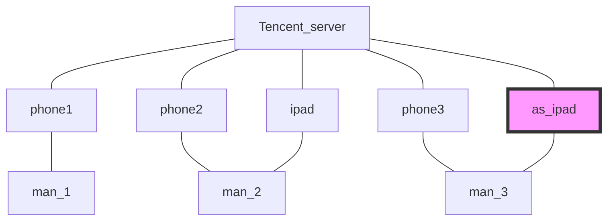

##### 运作流程

```mermaid
graph LR;
A(注册)-->B(二维码登录);
B-->首次登录分配ADid
B-->C(拉取发单群)
C-->D(选择推送商品)
D-->微信群自动广告
a(从淘宝联盟拉取商品信息)-->b(生成营销图文)
b-.-D

c(微信群成员购买)-->d(ADid与购买挂钩)
d-->e(买家折扣和广告佣金)
e-->多劳多得发钱
```

##### 微信接口的原理

微信可以手机、网页/电脑客户端、iPad三者同时登录，但是不能*手机+手机、网页+电脑、ipad+ipad* 的方式登录。

所以，与微信的收发报文的接口，写成 ipad wechat app 那样，就可以了。

```mermaid
graph TD;
Tencent_server---phone1; phone1---man_1
Tencent_server---phone2; phone2---man_2
Tencent_server---ipad; ipad---man_2
Tencent_server---phone3; phone3---man_3
Tencent_server---a[as_ipad]; a---man_3
style a fill:#f9f,stroke:#333,stroke-width:4px
```

